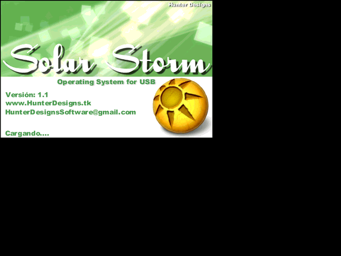



## Solar Storm OS

### Description

Solar Storm OS is an operating system created for USB. Has many features that make it ideal to carry around with everything organized in your pen drive in a simple way.

Controls the time, date system, if connected to the Internet, an Internet browser, a really good file browser and thousands of more options that make it unique in this field.

It's just a beta version but with your help i can improve more and more. If you like the source code do not hesitate to vote for me

Solar Storm OS es un sistema operativo creado para USB. Tiene muchas características que lo hacen ideal para llevar siempre encima todo organizado en pendrive de una manera sencilla.

Controla el tiempo, sistema de fechas, si está conectado a Internet, un navegador de Internet, un explorador de archivos muy bueno y miles de opciones más que la hacen único en este campo.

Es sólo una versión beta, pero con tu ayuda puedo mejorar más y más. Si te gusta el código fuente no dude en votar por mí
 
### More Info
 

             |
---                |---
**Submitted On**   |2010-07-09 00:00:48
**By**             |[Matias Ferrari](https://github.com/Planet-Source-Code/PSCIndex/blob/master/ByAuthor/matias-ferrari.md)
**Level**          |Intermediate
**User Rating**    |4.8 (29 globes from 6 users)
**Compatibility**  |VB 6\.0
**Category**       |[Complete Applications](https://github.com/Planet-Source-Code/PSCIndex/blob/master/ByCategory/complete-applications__1-27.md)
**World**          |[Visual Basic](https://github.com/Planet-Source-Code/PSCIndex/blob/master/ByWorld/visual-basic.md)
**Archive File**   |[Solar\_Stor2185317262010\.zip](https://github.com/Planet-Source-Code/matias-ferrari-solar-storm-os__1-73300/archive/master.zip)

